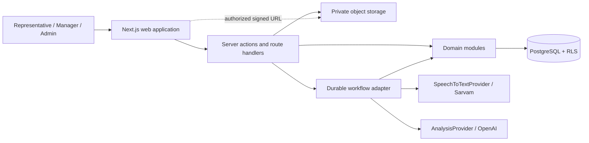
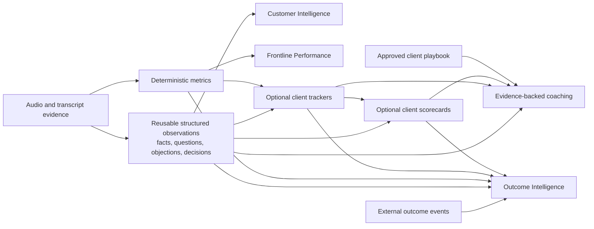
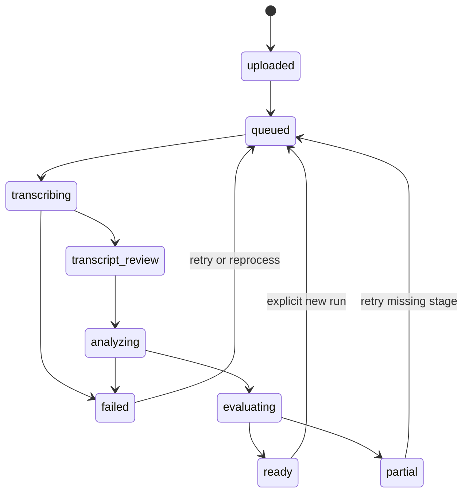

# Architecture

## Decision summary

ANUMA is a modular monolith deployed as a Next.js App Router application with strict TypeScript. PostgreSQL is the authoritative data store; Supabase is the preferred MVP platform for Postgres, authentication, and private object storage. Durable background workflows execute transcription, deterministic metrics, structured analysis, and only the optional downstream consumers selected by an organization's configuration.

The architecture optimizes for the expensive-to-change concerns: tenant ownership, immutable evidence, explicit data grain, version lineage, append-only corrections, event-based outcomes, and configuration versioning.

## Logical topology



## Intelligence dependency graph

ANUMA is a dependency graph, not a mandatory linear pipeline. Evidence creates reusable observations and deterministic measures. Each consumer selects compatible, versioned inputs independently; it does not require every preceding product capability to exist.



The graph does not imply that every edge is present for every organization or conversation. Trackers and scorecards are client-specific optional consumers; coaching is optional and consumes evidence and underlying observations in addition to any score results. Outcomes are external business events associated with conversations/opportunities, not a result of ANUMA coaching or scoring.

## Extract once, reuse many times

The semantic-analysis stage produces validated, evidence-backed observations for reuse. Customer Intelligence, management aggregates, deterministic tracker values, scorecard calculations, outcome comparisons, and reports must consume the existing typed observations/metrics whenever they can reliably answer the question.

Before invoking a model, the application service must check whether the requested result is available from compatible structured observations or deterministic computation. A new model call is justified only when it performs genuinely new semantic interpretation; it is not a formatting mechanism for a dashboard, aggregate, or policy calculation. This keeps cost, latency, inconsistency, and model-version drift out of downstream consumers.

## Incremental-value test

Every proposed processing stage or abstraction must satisfy at least one of these tests:

1. creates new information;
2. standardizes information for reuse;
3. applies client-specific business interpretation;
4. enables a user decision or action; or
5. links interaction information with external business truth.

Do not introduce a layer that merely reformats information already available without adding one of these forms of value.

## Implementation classifications

- **MVP CORE**: required to prove the MVP thesis and implemented in the phase that owns the capability.
- **MVP SUPPORTING**: required for a safe, operable pilot, but should be implemented only when its consuming core flow needs it.
- **DEFERRED**: retained as a future-safe architectural boundary; do not implement it in Phase 1 or Phase 2 unless a later phase or explicit founder decision promotes it.

Documentation of an entity or module is not authorization to implement it early. Phase plans must select the smallest set of MVP CORE and immediately necessary MVP SUPPORTING structures.

## Module boundaries

| Module | Classification | Owns | Must not own |
|---|---|---|---|
| Identity & tenancy | MVP CORE | organizations, memberships, customer roles, teams, locations, effective assignments | UI-only authorization or internal ANUMA access |
| Conversations | MVP CORE | interactions, participants, consent, recordings, lifecycle, conversation-level quality assessment | provider payloads |
| Transcription | MVP CORE | transcription runs, normalized segments, speaker mappings | business facts |
| Metrics | MVP CORE | deterministic definitions, runs, values, quality and eligibility inputs | prompt-based arithmetic |
| Intelligence | MVP CORE | analysis runs, facts, questions, responses, objections, decision observations, evidence | score policy or authoritative outcomes |
| Configuration | MVP CORE | domain packs and tracker/scorecard definitions and publications | evaluation results |
| Evaluation | MVP CORE | optional tracker runs/results, optional scorecard runs/results, optional coaching | redetection duplicated in scorecards or mandatory gating of independent insights |
| Outcomes | MVP CORE | append-only external business events and derived current state | mutable “final outcome” truth, CRM opportunity management, or dependence on scoring/coaching |
| Corrections | MVP CORE | proposals, approvals/rejections, typed overlays and effective reviewed state | deletion of original output |
| Insights | MVP CORE | tenant-scoped aggregates, eligibility gates, maturity gates, drill-down cohorts | causal inference |
| Audit & governance | MVP SUPPORTING | pilot-critical audit events and retention/deletion workflows | secrets or transcript bodies in logs |
| Quality lab | MVP SUPPORTING | approved fixtures, judgments, experiment comparisons | routine membership or production-data access in customer tenants |
| Custom dimensions | DEFERRED | governed organization-defined analytical dimensions | arbitrary JSON or unrestricted querying |
| Internal access grants | DEFERRED | explicit, time-bounded, purpose-limited ANUMA support/quality access | ordinary customer organization roles |

Modules communicate through typed application services and domain values. React components render application DTOs; they do not calculate domain metrics or evaluate business rules. Consumer modules declare the exact compatible input versions they use; they may not create a transcript-to-model dependency when reusable observations or deterministic values already answer the request.

## Request and authorization path

1. Authenticate the user with Supabase Auth.
2. Resolve active organization membership on the server; never accept organization identity from the browser without verifying membership.
3. Enforce role and scope in the application service.
4. Issue tenant-constrained SQL and rely on RLS as defense in depth.
5. Audit privileged reads, exports, configuration publication, corrections, outcome changes, signed playback, and deletion actions.

Every tenant-owned row carries `organization_id`, including child and derived records where practical. This deliberate denormalization makes RLS direct, reduces unsafe joins, and simplifies tenant-scoped partitioning and deletion. Foreign keys use composite organization-aware constraints for critical ownership paths.

A user may hold memberships in multiple organizations and must select or resolve one active organization context per request. Customer roles are only `representative`, `manager`, and `admin`. Representatives can have effective-dated team/location assignments; each conversation snapshots its representative, team, and location context. Managers see assigned team/location scope, while admins see their organization.

## Processing lifecycle



This lifecycle records capture and processing availability; it is not the intelligence dependency graph. `evaluating` means one or more configured optional evaluations are running or pending, not that trackers, scorecards, coaching, or outcomes must run in sequence. Outcomes can arrive before, during, or after any processing state.

The conversation lifecycle is derived from stage attempts, not the only record of processing. Each workflow step:

- accepts a stable idempotency key such as `(conversation_id, stage, input_version_hash)`;
- creates an immutable run/attempt before external work;
- leases work with heartbeat/timeout semantics;
- records provider request ID, timing, cost, errors, and sanitized diagnostics;
- writes results transactionally, then advances the workflow;
- can retry safely without overwriting successful historical output.

The active transcription/analysis pointers are updated only after a complete validated run. Reanalysis can reuse a prior immutable transcript.

## Evidence architecture

`evidence_refs` is the shared citation layer. Each reference targets one immutable `transcript_segment` from a specific transcription run and may narrow it with start/end offsets and a verbatim excerpt checksum. An evidence group can contain multiple ordered references for a single claim.

Evidence consumers include facts, question/response records, objections, tracker results, score criteria, coaching, and management insight drill-downs. The reference remains valid when a different transcription run becomes active. If a speaker mapping changes, the evidence is unchanged and the effective speaker is resolved through the mapping version used by the consuming run.

## Provider abstraction

```ts
interface SpeechToTextProvider {
  readonly key: string;
  submit(input: SpeechJobInput): Promise<SpeechSubmission>;
  getStatus(requestId: string): Promise<SpeechJobStatus>;
  fetchResult(requestId: string): Promise<unknown>;
  normalize(raw: unknown, context: NormalizeSpeechContext): Promise<NormalizedTranscript>;
}

interface AnalysisProvider {
  readonly key: string;
  analyze<T>(request: AnalysisRequest<T>): Promise<AnalysisResponse<T>>;
}
```

The adapter validates provider responses. Domain services receive only normalized types. Provider/model keys, timeouts, pricing tables, and capabilities are configuration driven (`SPEECH_PROVIDER`, `SPEECH_MODEL`, `ANALYSIS_PROVIDER`, `ANALYSIS_MODEL`). The MVP implements Sarvam and OpenAI only, while the ports make controlled experiments possible later.

## Analytics strategy

Start with tenant-scoped PostgreSQL views for current effective facts and materialized views for higher-cost aggregates. Every management finding stores or can reconstruct definition, cohort filter, date range, numerator, denominator, sample size, source refresh time, and conversation IDs for drill-down.

Before a conversation contributes to aggregates, a versioned conversation quality assessment evaluates audio, transcription, diarization, speaker mapping, and semantic analysis quality against a published eligibility policy. It records categorical quality states, source run/version IDs, review state, eligibility flags, and exclusion reasons; it does not invent a composite numerical quality score.

Aggregate views join the assessment that matches the exact active source runs used by the aggregate. They exclude conversations that are not `analytics_eligible` from analytical denominators, not `benchmark_eligible` from benchmark cohorts, and not `outcome_comparison_eligible` from outcome comparisons. Every view also returns total considered, included, excluded, unassessed, and exclusion counts by reason so coverage is disclosed rather than hidden. Operational coverage views may include ineligible conversations when their purpose is to show processing or quality failures.

Refresh aggregate projections after processing, quality review, correction, or outcome changes and on a scheduled repair job. Never let an aggregate bypass RLS or tenant filters. Below maturity thresholds, return learning progress rather than a comparison. Benchmark and outcome thresholds remain governance defaults subject to pilot validation.

## Correction workflow

The proposed MVP default is that representatives may propose corrections on eligible outputs associated with their accessible conversations. Managers and admins within scope may accept or reject proposals. Original provider/model output is immutable; the latest accepted, non-superseded correction becomes the effective reviewed projection. The authority matrix may become organization-configurable later, but Phase 1 and Phase 2 should implement this default rather than an open-ended permissions engine.

## Custom dimensions

Avoid arbitrary columns and unrestricted JSON querying. The future-safe design uses versioned `dimension_definitions` per platform/domain pack/organization and typed `dimension_values` on supported subjects. This capability is DEFERRED for the initial MVP; high-value shared filters use first-class columns/tables, and validated JSONB may hold non-query-critical long-tail payloads until a pilot need justifies custom dimensions.

## Deployment and operations

- Next.js on Vercel or a compatible Node runtime.
- Supabase Postgres/Auth/private Storage in an approved region.
- A durable workflow product selected before Phase 3; the domain depends on an internal workflow port.
- Structured logs with correlation/run IDs and redaction.
- Error monitoring and product telemetry without transcript/audio contents.
- Database migrations are forward-only, reviewed, and tested against RLS.
- Point-in-time database recovery and storage lifecycle policies are required before pilot data.

## Architectural risks

| Risk | Consequence | Mitigation |
|---|---|---|
| Diarization/timestamp quality varies across languages | Wrong attribution and misleading metrics | explicit quality status, speaker review, immutable remapping, eligibility gates |
| Long-running work exceeds request lifetimes | stuck or duplicated runs | durable workflows, idempotency, leases, repair scans |
| JSONB becomes an ungoverned schema | weak analytics and migrations | versioned definitions, typed value tables, schema validation |
| RLS gaps on derived tables/storage | cross-tenant disclosure | redundant organization ownership, policy tests, signed access service |
| Configuration edits rewrite history | unauditable evaluations | immutable published versions and run snapshots |
| Evidence breaks after reprocessing | loss of trust | references bind to immutable run/segment IDs |
| Small samples encourage false claims | misleading management action | eligibility rules, maturity gates, sample sizes, descriptive language |
| Model output contains prompt-injected instructions | unsafe analysis | transcript as quoted data, structured schemas, tool-free analysis jobs, output validation |
| Provider price/version changes | cost or quality drift | model registry, run provenance, explicit promotions and evaluation gates |

## Architecture decisions to settle before Phase 1

- Supabase project region and data residency constraints.
- Workflow platform and maximum supported audio duration/file size.
- Default retention/deletion windows and legal-hold behavior.
- Exact RLS operations within the founder-approved representative, assigned manager, and organization admin scopes.
- Definition publication/promotion approval workflow.
- Initial categorical quality rules and exclusion reason taxonomy; thresholds require pilot validation.
- Benchmark eligibility, outcome window, and minimum per-cohort thresholds after pilot validation.
- Approved client playbooks and the review process for clearly labelled generic coaching.
