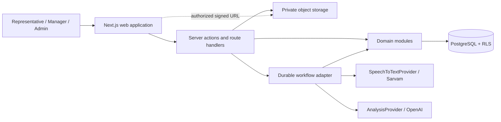
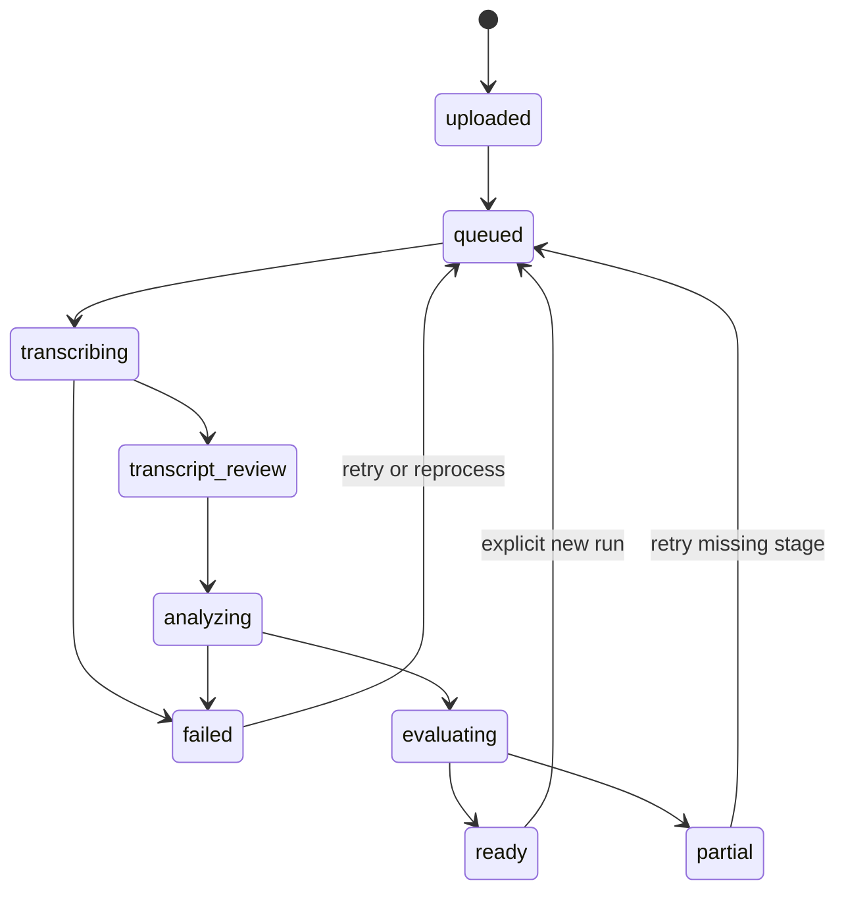

# Architecture

## Decision summary

ANUMA is a modular monolith deployed as a Next.js App Router application with strict TypeScript. PostgreSQL is the authoritative data store; Supabase is the preferred MVP platform for Postgres, authentication, and private object storage. Durable background workflows execute transcription, deterministic metrics, structured analysis, trackers, scorecards, coaching, and aggregate refreshes.

The architecture optimizes for the expensive-to-change concerns: tenant ownership, immutable evidence, explicit data grain, version lineage, append-only corrections, event-based outcomes, and configuration versioning.

## Logical topology



## Module boundaries

| Module | Owns | Must not own |
|---|---|---|
| Identity & tenancy | organizations, memberships, roles, teams, locations, assignments | UI-only authorization |
| Conversations | interactions, participants, consent, recordings, lifecycle | provider payloads |
| Transcription | transcription runs, normalized segments, speaker mappings | business facts |
| Metrics | deterministic definitions, runs, values, quality | prompt-based arithmetic |
| Intelligence | analysis runs, facts, questions, responses, objections, evidence | score policy |
| Configuration | domain packs, dimensions, tracker/scorecard definitions and publications | evaluation results |
| Evaluation | tracker runs/results, scorecard runs/results, coaching | redetection duplicated in scorecards |
| Outcomes | append-only outcome events and derived current state | mutable “final outcome” truth |
| Corrections | generic typed correction overlays and review state | deletion of original output |
| Insights | tenant-scoped aggregates, maturity gates, drill-down cohorts | causal inference |
| Quality lab | fixtures, judgments, experiment comparisons | production data access by default |
| Audit & governance | audit events, retention/deletion workflows, export records | secrets or transcript bodies in logs |

Modules communicate through typed application services and domain values. React components render application DTOs; they do not calculate domain metrics or evaluate business rules.

## Request and authorization path

1. Authenticate the user with Supabase Auth.
2. Resolve active organization membership on the server; never accept organization identity from the browser without verifying membership.
3. Enforce role and scope in the application service.
4. Issue tenant-constrained SQL and rely on RLS as defense in depth.
5. Audit privileged reads, exports, configuration publication, corrections, outcome changes, signed playback, and deletion actions.

Every tenant-owned row carries `organization_id`, including child and derived records where practical. This deliberate denormalization makes RLS direct, reduces unsafe joins, and simplifies tenant-scoped partitioning and deletion. Foreign keys use composite organization-aware constraints for critical ownership paths.

## Processing lifecycle



The conversation lifecycle is derived from stage attempts, not the only record of processing. Each workflow step:

- accepts a stable idempotency key such as `(conversation_id, stage, input_version_hash)`;
- creates an immutable run/attempt before external work;
- leases work with heartbeat/timeout semantics;
- records provider request ID, timing, cost, errors, and sanitized diagnostics;
- writes results transactionally, then advances the workflow;
- can retry safely without overwriting successful historical output.

The active transcription/analysis pointers are updated only after a complete validated run. Reanalysis can reuse a prior immutable transcript.

## Evidence architecture

`evidence_refs` is the shared citation layer. Each reference targets one immutable `transcript_segment` from a specific transcription run and may narrow it with start/end offsets and a verbatim excerpt checksum. An evidence group can contain multiple ordered references for a single claim.

Evidence consumers include facts, question/response records, objections, tracker results, score criteria, coaching, and management insight drill-downs. The reference remains valid when a different transcription run becomes active. If a speaker mapping changes, the evidence is unchanged and the effective speaker is resolved through the mapping version used by the consuming run.

## Provider abstraction

```ts
interface SpeechToTextProvider {
  readonly key: string;
  submit(input: SpeechJobInput): Promise<SpeechSubmission>;
  getStatus(requestId: string): Promise<SpeechJobStatus>;
  fetchResult(requestId: string): Promise<unknown>;
  normalize(raw: unknown, context: NormalizeSpeechContext): Promise<NormalizedTranscript>;
}

interface AnalysisProvider {
  readonly key: string;
  analyze<T>(request: AnalysisRequest<T>): Promise<AnalysisResponse<T>>;
}
```

The adapter validates provider responses. Domain services receive only normalized types. Provider/model keys, timeouts, pricing tables, and capabilities are configuration driven (`SPEECH_PROVIDER`, `SPEECH_MODEL`, `ANALYSIS_PROVIDER`, `ANALYSIS_MODEL`). The MVP implements Sarvam and OpenAI only, while the ports make controlled experiments possible later.

## Analytics strategy

Start with tenant-scoped PostgreSQL views for current effective facts and materialized views for higher-cost aggregates. Every management finding stores or can reconstruct definition, cohort filter, date range, numerator, denominator, sample size, source refresh time, and conversation IDs for drill-down.

Refresh aggregate projections after processing/outcome changes and on a scheduled repair job. Never let an aggregate bypass RLS or tenant filters. Below maturity thresholds, return learning progress rather than a comparison.

## Custom dimensions

Avoid arbitrary columns and unrestricted JSON querying. Define versioned `dimension_definitions` per platform/domain pack/organization and attach typed `dimension_values` to supported subjects (conversation, location, product, representative, or outcome). Supported value kinds are text, enum, number, boolean, date, entity reference, and money. High-value shared filters remain first-class columns/tables; JSONB holds validated long-tail payloads only.

## Deployment and operations

- Next.js on Vercel or a compatible Node runtime.
- Supabase Postgres/Auth/private Storage in an approved region.
- A durable workflow product selected before Phase 3; the domain depends on an internal workflow port.
- Structured logs with correlation/run IDs and redaction.
- Error monitoring and product telemetry without transcript/audio contents.
- Database migrations are forward-only, reviewed, and tested against RLS.
- Point-in-time database recovery and storage lifecycle policies are required before pilot data.

## Architectural risks

| Risk | Consequence | Mitigation |
|---|---|---|
| Diarization/timestamp quality varies across languages | Wrong attribution and misleading metrics | explicit quality status, speaker review, immutable remapping, eligibility gates |
| Long-running work exceeds request lifetimes | stuck or duplicated runs | durable workflows, idempotency, leases, repair scans |
| JSONB becomes an ungoverned schema | weak analytics and migrations | versioned definitions, typed value tables, schema validation |
| RLS gaps on derived tables/storage | cross-tenant disclosure | redundant organization ownership, policy tests, signed access service |
| Configuration edits rewrite history | unauditable evaluations | immutable published versions and run snapshots |
| Evidence breaks after reprocessing | loss of trust | references bind to immutable run/segment IDs |
| Small samples encourage false claims | misleading management action | eligibility rules, maturity gates, sample sizes, descriptive language |
| Model output contains prompt-injected instructions | unsafe analysis | transcript as quoted data, structured schemas, tool-free analysis jobs, output validation |
| Provider price/version changes | cost or quality drift | model registry, run provenance, explicit promotions and evaluation gates |

## Architecture decisions to settle before Phase 1

- Supabase project region and data residency constraints.
- Multi-organization membership and location assignment cardinality.
- Workflow platform and maximum supported audio duration/file size.
- Default retention/deletion windows and legal-hold behavior.
- Exact RLS role matrix and internal support access process.
- Definition publication/promotion approval workflow.
- Benchmark eligibility and minimum per-cohort thresholds.

