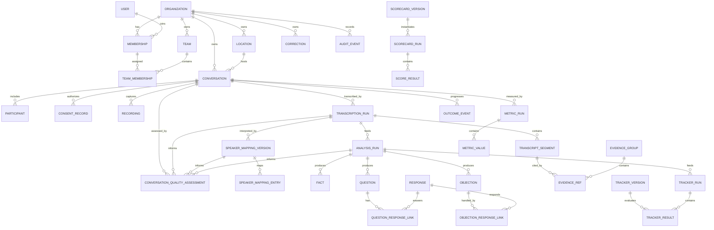

# Data Model

## Modeling rules

- UUID primary keys; `timestamptz` in UTC; `created_at` on every record and `updated_at` only on genuinely mutable records.
- Tenant-owned records carry `organization_id NOT NULL`. Critical child foreign keys also constrain organization identity.
- Immutable published definitions and machine runs are never updated in place except operational status fields while running.
- Original machine output and provider payloads are retained in private, access-controlled JSONB; effective reviewed values are projections.
- Money uses `amount_minor bigint` plus `currency_code char(3)`.
- Evidence targets immutable transcript segments, not the currently active transcript.
- JSONB is validated and versioned; commonly filtered identifiers, statuses, dates, and values use typed columns.

## Entity relationship model

## Implementation classification

| Classification | Major entities to implement |
|---|---|
| **MVP CORE** | `users`, `organizations`, `memberships`, `locations`, `teams`, effective-dated assignments, `conversations`, `participants`, `consent_records`, `recordings`, transcription/speaker-mapping/analysis runs, transcript segments, evidence, facts, questions/responses, objections/handling, decision observations, metric runs/values, conversation quality assessments, trackers, scorecards, coaching, corrections, and outcome events |
| **MVP SUPPORTING** | `processing_attempts`, the minimum model/prompt/taxonomy/domain-pack registries required for reproducibility, review tasks/comments where needed by corrections, pilot-critical audit events, retention policies/deletion requests, pack entity aliases required by the first pilots, and the minimal `opportunities`/conversation link only if a pilot requires multi-interaction association |
| **DEFERRED** | general custom-dimension storage, full entity-master management beyond pilot dictionaries, durable internal ANUMA access grants, advanced quality-lab experiment management, CRM-style/generalized opportunity workflows, exports, and enterprise legal-hold machinery |

An entity being described below does not promote it into the immediate Phase 2 build. Phase 2 implements MVP CORE data foundation plus only the MVP SUPPORTING records needed by the next authorized flow. DEFERRED concepts remain documented so later additions do not break data grain or tenant ownership.

## Identity, tenancy, and organization structure

### `users`

Global authenticated identity: `id`, auth subject, display name, status, timestamps. It contains no tenant role.

### `organizations`

Tenant root: `id`, name, slug, status, default locale/timezone/currency, retention policy ID, timestamps.

### `memberships`

One user in one organization: `id`, `organization_id`, `user_id`, role (`representative`, `manager`, `admin`), status, joined/ended timestamps. Unique active membership per user/organization. A user may hold active memberships in multiple organizations, but each request resolves one active organization context.

`internal_quality` is not a customer membership role. A future internal-access model, if approved, must use separate purpose-limited, time-bounded, customer-visible where required, and fully audited grants rather than ordinary tenant membership. The MVP quality lab uses synthetic, de-identified, or explicitly authorized fixtures/data.

### `locations`, `teams`, `team_memberships`

Locations form an optional adjacency-list hierarchy with type (`region`, `store`, `showroom`, `other`). Teams optionally belong to a location. Team/location assignments relate an organization membership to a team and/or location with effective dates. Representatives may hold multiple effective-dated assignments. Conversation rows snapshot the responsible representative, team, and location identifiers; later assignment changes do not rewrite history. Managers see their assigned team/location scope, while admins see their organization.

## Conversations, consent, and recordings

### `conversations`

The commercial interaction grain: `id`, `organization_id`, vertical pack version, interaction type, representative membership ID, location/team IDs, occurred/start/end timestamps, source, lifecycle status, detected locale summary, active transcription/analysis/mapping IDs, created by, timestamps.

A conversation may have multiple recordings and many processing runs. A conversation is not a file, transcript, or opportunity.

### `conversation_quality_assessments`

Append-only, versioned assessment at the conversation and exact processing-input grain: `id`, `organization_id`, `conversation_id`, policy/version, transcription run ID, speaker-mapping version ID, analysis run ID where relevant, producer and producer version, `audio_quality`, `transcription_quality`, `diarization_quality`, `speaker_mapping_quality`, `semantic_analysis_quality`, `analytics_eligible`, `benchmark_eligible`, `outcome_comparison_eligible`, structured exclusion reason codes/notes, `review_state`, reviewer/correction lineage, and timestamps.

Quality dimensions use categorical states such as `adequate`, `limited`, `insufficient`, `unknown`, and `not_assessed`, with dimension-specific evidence/diagnostics. A producer may record its native confidence separately when documented, but the model must not manufacture a composite numerical quality score. Eligibility flags are outputs of a published quality/eligibility policy and can be human-reviewed without overwriting the original assessment.

Assessments are recalculated when the active transcription, mapping, analysis, or policy version changes. Analytical projections use the assessment matching the source run combination they query. They disclose included, excluded, unassessed, and exclusion-reason counts; operational quality/coverage reporting may intentionally include ineligible conversations.

### `participants`

Known or anonymous people in the interaction: conversation ID, role, optional membership ID, pseudonymous external reference, display label, metadata. Do not require customer PII.

### `consent_records`

Append-only consent evidence: conversation ID, capture method, policy/version, jurisdiction when known, captured at/by, participant scope, status (`granted`, `declined`, `withdrawn`, `not_required`, `unknown`), evidence metadata. Withdrawal can trigger a governed retention/deletion workflow; it does not erase the audit record.

### `recordings`

One uploaded/captured media object: storage bucket/key, checksum, MIME type, bytes, duration, capture source, upload status, encryption/storage metadata, retention expiry, deleted timestamp, and recorder. Objects live under an organization/conversation-scoped private prefix. Never persist signed URLs.

## Transcription and speaker identity

### `transcription_runs`

One attempt/configuration against a conversation/recording set: provider, model, provider model version, adapter version, status, input checksum, idempotency key, provider request ID, start/end/latency, audio duration, detected languages, cost/currency, error code/message, raw payload object reference, created by. Unique idempotency key.

### `transcript_segments`

Immutable normalized segment: run ID, organization/conversation IDs, ordinal, provider segment ID, provider speaker ID, start/end seconds, original text, optional normalized text, language codes, provider confidence, token/word estimate, checksum. Enforce ordered, non-negative timing and uniqueness of ordinal per run.

### `speaker_mapping_versions` and `speaker_mapping_entries`

A mapping version belongs to one transcription run and records source (`model`, `human`, `hybrid`), creator/reviewer, reason, status, timestamps. Entries map a provider speaker ID to a supported role and optional participant. Corrections publish a new mapping version; segments remain unchanged. Analysis and metric runs bind to a mapping version.

## Machine runs and registries

### `model_registry_entries`

Provider/model capability metadata, logical key, provider version, pricing version, enabled environments, and effective dates. Credentials never enter the database.

### `prompt_versions`, `taxonomy_versions`, `domain_pack_versions`

Immutable content-addressed artifacts with semantic version, status (`draft`, `published`, `retired`), schema version, content/checksum, author, published timestamp. Published content is never modified.

### `analysis_runs`

One structured-analysis attempt over a specific transcription and speaker mapping version: provider/model/model version, prompt bundle version, taxonomy/domain pack versions, output schema version, status, idempotency key, input hash, start/end/latency, token counts, estimated cost, error, raw response reference, human quality status. It is the parent provenance record for semantic outputs.

### `processing_attempts`

Operational workflow attempts by stage: conversation, run target, attempt number, lease/heartbeat, status, scheduled/start/end times, retry reason, sanitized error, workflow provider ID. This separates retry mechanics from semantic run identity.

## Evidence

### `evidence_groups`

Reusable citation container: organization/conversation IDs, label/purpose, created by run or user, timestamps.

### `evidence_refs`

Evidence group, transcription run, segment, ordinal, optional start/end seconds inside segment bounds, excerpt, excerpt checksum, attribution mapping version. A database trigger/check validates that organization, conversation, run, and segment all agree.

Semantic records point to an evidence group and may require at least one reference before becoming publishable. Evidence is not free-form text alone.

## Structured intelligence grains

The existing independent records are intentional: analysis produces reusable facts/questions/responses/objections, metric runs produce deterministic values, tracker/scorecard/coaching runs record optional client-specific consumers, and outcome events are external business truth. No new dependency table or schema redesign is required to enforce a linear pipeline; each consumer binds only the compatible source runs and inputs it actually uses.

### `fact_definitions`

Versioned taxonomy item with stable key, category, value type, cardinality, allowed roles, aggregation rules, sensitivity, and vertical applicability.

### `facts`

One assertion instance: analysis run, fact definition version, subject type/ID, speaker role, normalized typed value columns plus validated long-tail JSONB, display text, evidence group, confidence, review state, and occurrence time. Repeated mentions may be separate observations; a resolver can project a current entity-level fact without discarding them.

Decision drivers and barriers are evidence-backed fact definitions in the shared `decision.*` namespace. They describe conversation observations such as a primary driver, purchase barrier, reason for deferral, or explicit loss signal. They remain distinct from an objection event and from an authoritative client-supplied outcome/lost-reason event. A model inference cannot update or replace outcome history.

### `questions`

One substantive or rhetorical utterance identified as a question: analysis run, asker role/participant, occurrence time, original text, normalized topic definition, type (`open`, `closed`, `clarification`, `rhetorical`, `other`), substantive flag, evidence group, confidence, review state.

### `responses`

One candidate answer/response unit: analysis run, responder role/participant, occurrence time, text, evidence group, confidence, review state. A response can link to more than one question.

### `question_response_links`

Question ID, response ID nullable for explicitly unanswered questions, state (`answered`, `partially_answered`, `unanswered`, `uncertain`, `not_applicable`), optional reliable latency, rationale, evidence group, confidence. Unique selected link rules prevent contradictory effective states while preserving alternative run outputs.

### `objections`

One customer objection event: analysis run, objection definition/category, statement, occurrence time, optional product/entity and money references, evidence group, confidence, review state.

### `objection_response_links`

Objection, optional response, response time, handling approach definition, resolution (`resolved`, `partially_resolved`, `unresolved`, `deferred`, `uncertain`, `not_applicable`), evidence group, confidence. This avoids embedding a mutable response blob inside the objection.

### `commitments` and `next_actions`

Typed closing outputs: owner role/participant, action/commitment definition, due date/time precision, status, evidence, confidence. These are preferable to hiding operational next steps in generic fact JSON.

## Metrics

### `metric_definitions`

Stable catalog key, definition version, unit, value type, deterministic/inferred producer, formula version, eligible roles, quality rules, and display precision.

### `metric_runs` and `metric_values`

A run binds conversation, transcription run, speaker mapping version, algorithm version, input hash, and status. Each value binds a metric definition and optional participant/role, typed numeric/duration/count value, numerator/denominator where relevant, quality status, sample/eligibility metadata, and diagnostic reason. Recalculation creates a new run.

## Trackers, scorecards, and coaching

### `tracker_definitions` and `tracker_versions`

Stable organization-owned identity plus immutable versions. A version contains type, fact dependencies, applicability expression, value schema, detection method, prompt/rule version, confidence policy, evidence requirement, and domain pack compatibility.

### `tracker_runs` and `tracker_results`

A run binds a conversation, analysis/transcription/mapping inputs, and a tracker-set publication. A result binds exactly one tracker version and stores state, typed structured value, evidence, confidence, original detector output, producer/run IDs, and review projection.

### `scorecard_definitions`, `scorecard_versions`, `scorecard_criteria_versions`

Stable scorecard identity and immutable published versions. Criteria hold weight, maximum score, applicability expression, required fact/tracker keys, critical-failure policy, evidence requirement, uncertainty policy, and calculation rule.

### `scorecard_runs` and `score_results`

One evaluation of a conversation against one published scorecard version. Criteria results store state, awarded/max points, applicability explanation, input fact/tracker result IDs, evidence, and evaluation version. Totals exclude not-applicable criteria from the denominator according to the published policy.

### `coaching_runs` and `coaching_items`

A coaching run binds the scorecard/tracker/analysis inputs and playbook version. Items are categorized as strength or priority, ordered and capped, with observed behavior, why it matters, recommended behavior, optional approved/generic example phrasing label, evidence, and confidence.

## Corrections and review

### `corrections`

Append-only polymorphic correction: organization, target type/ID, target field/path, original serialized value and hash, corrected typed value, reason code/note, reviewer membership, status (`proposed`, `accepted`, `rejected`, `superseded`), created/reviewed timestamps, source run/model/prompt references. A correction may supersede an earlier correction; it never changes original output.

Effective-value views select the latest accepted, non-superseded correction for an allowed target/field. Target allowlists and per-type schemas prevent arbitrary mutation paths.

The MVP authority default is: representatives may propose corrections on eligible outputs in conversations they can access; managers/admins in scope may accept or reject them. Proposals have no effect until accepted. Accepted corrections become the effective reviewed projection, while original model/provider output and rejected/superseded proposals remain auditable. This policy may become organization-configurable later.

### `review_tasks` and `comments`

Optional review queue for uncertain/high-impact findings, with assignment, priority, status, and resolution. Comments are collaborative context and do not themselves change data.

## Outcomes and opportunity linkage

### `opportunities`

Optional client-neutral commercial thread linking multiple conversations: organization, external/manual reference, vertical, opened/closed dates, current derived state, owner, location. It allows a showroom visit, follow-up, and delivery to belong to one opportunity without requiring a CRM.

ANUMA does not implement CRM opportunity management. This abstraction exists only when a pilot needs to associate multiple interactions and outcome events with one commercial thread. It must not grow into pipelines, forecasting, task management, or CRM ownership logic during the MVP.

### `conversation_opportunities`

Many-to-many link with relationship type and effective ordering. Keep optional because some retail interactions do not expose a stable opportunity.

### `outcome_events`

Append-only external business event: organization, optional opportunity/conversation, vertical-specific event definition, occurred/recorded timestamps, source (`manual`, later `import`), actor, amount/currency fields for revenue/discount/margin, product reference, metadata, and supersedes event ID. A projection calculates current outcome; deletion/correction produces a compensating event. Outcome events do not depend on tracker, scorecard, or coaching runs; Outcome Intelligence joins them to compatible prior interaction observations for descriptive comparison.

## Custom dimensions and entities

### `entity_definitions`, `entities`, `entity_aliases`

Versioned product/brand/model/competitor vocabularies can be global pack defaults or organization overrides. Aliases support multilingual and misspelled mentions while keeping a canonical entity ID.

### `dimension_definitions` and `dimension_values`

DEFERRED. The future design specifies subject types, value type, enum/entity constraints, filterability, sensitivity, and version. Values use typed columns with a subject ID and effective dates. Only approved dimensions can participate in aggregates. Do not implement this general mechanism in Phase 2 unless a confirmed pilot requirement cannot be represented by the core schema or versioned pack configuration.

## Audit, retention, and deletion

### `audit_events`

Append-only actor/action/resource metadata, organization, request/correlation IDs, timestamp, coarse result and safe metadata. Do not store transcript bodies, secrets, or signed URLs.

### `retention_policies` and `deletion_requests`

Versioned policy by data class; requests record scope, authority, approval, scheduled/executed times, status, failures, and audit linkage. Deletion is an idempotent workflow spanning storage, tenant data, derived aggregates, and provider-side artifacts where supported. Minimal legal/audit tombstones are governed separately.

## Required indexes and constraints

- Tenant/date indexes on conversations, runs, outcomes, facts, questions, objections, and audit events.
- Quality-assessment indexes on conversation/policy/source-run combination and each eligibility flag for tenant-scoped aggregate joins.
- Unique `(organization_id, id)` pairs where composite tenant-safe foreign keys are used.
- Segment indexes on `(transcription_run_id, ordinal)` and GiST/full-text support for authorized transcript search.
- Partial unique indexes for active memberships and one published semantic version per definition/version.
- Checks for segment timing, confidence bounds, non-negative money/durations, and outcome linkage.
- GIN only on intentionally queried JSONB paths; do not create a universal JSON escape hatch.

## RLS posture

Users can access records only through active memberships and scoped roles. Representatives see their own conversations; managers see assigned teams/locations; admins see their organization. Background workers set a verified organization context and operate on one tenant/job at a time. Service-role use is isolated to server workers and never accepted as a substitute for domain authorization. Future internal ANUMA access grants are separate from membership and are not part of the MVP tenant-role model.
