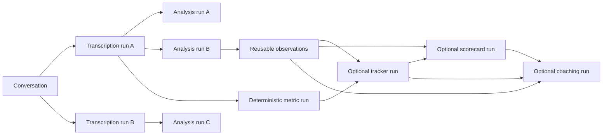

# Model and Provider Experimentation

## Goals

ANUMA must improve speech and analysis quality without losing historical reproducibility. Every provider/model/prompt/taxonomy change is an experiment that produces a new run, not an overwrite.

## Run lineage

The conversation has nullable active pointers for product display, but every downstream record binds exact source IDs. The graph illustrates possible provenance edges, not a mandatory sequence: observations and metrics may feed independent consumers, and coaching can use underlying evidence/observations as well as optional tracker/scorecard results. Promotion of an active run is an audited action and does not delete the prior active run.

## Registries and configuration

- `model_registry`: provider, model, provider version, task capabilities, pricing version, effective dates, environment allowlist.
- `prompt_version`: immutable system/task instructions, schema reference, examples/fixture set, checksum.
- `taxonomy_version` and `domain_pack_version`: immutable semantic vocabulary/configuration.
- `adapter_version`: normalization code release identifier.
- Environment keys select logical entries: `SPEECH_PROVIDER`, `SPEECH_MODEL`, `ANALYSIS_PROVIDER`, `ANALYSIS_MODEL`.

Do not hardcode provider selection in business services and do not spread raw Sarvam/OpenAI response objects beyond adapters.

## Speech provider port

The speech port supports submission, status retrieval/webhook handling, result retrieval, cancellation where supported, and normalization. The normalized contract includes provider speaker IDs, time ranges, original text, languages, confidence when meaningful, media duration, and provider metadata. Saaras v3 is the only production MVP implementation.

## Analysis provider port

The analysis port accepts an explicit task, untrusted transcript data envelope, locale/domain context, prompt/schema versions, and deterministic generation settings where available. It returns schema-validated structured output plus usage, latency, provider request ID, finish/error status, and raw response reference. The caller must first establish that the task cannot reliably be fulfilled from existing structured observations or deterministic computation.

The provider receives no database or external tools. Transcript content is clearly delimited as data and cannot modify system instructions. Output failing schema or evidence-integrity validation is rejected or routed to repair/review; it is never silently coerced into a claim.

## Experiment workflow

1. Define one hypothesis and task-specific acceptance thresholds.
2. Pin the input conversation/recording set and reviewed ground truth.
3. Run candidate and baseline with exact configuration snapshots.
4. Score individual tasks and slices (vertical, language, duration, quality).
5. Review disagreements and correction burden.
6. Compare quality, latency, cost, and failure rate.
7. Approve, reject, or shadow the candidate; record decision and evaluator.
8. Promote configuration separately per environment and monitor drift.

Production comparisons use explicit sampling and client authorization. Do not send tenant data to a new provider merely because an adapter exists. The MVP quality workflow does not grant ANUMA staff ordinary membership in customer organizations.

## Quality lab tasks

| Task | Primary measure | Supporting measures |
|---|---|---|
| Brand/product/model entity extraction | precision, recall, F1 | alias/link accuracy by language |
| Numeric/price extraction | exact match with unit/currency | tolerance match, subject linkage |
| Speaker attribution | role-attributed duration/segment accuracy | correction rate |
| Question detection | precision/recall | type/topic accuracy |
| Answer linkage | link/state accuracy | unanswered recall |
| Objection detection | precision/recall by category | handling/resolution accuracy |
| Evidence selection | segment/span support rate | citation completeness |
| Tracker evaluation | state/value accuracy by tracker version | N/A and uncertain accuracy |
| Operations | success rate | p50/p95 latency and cost/minute |

Never collapse these into a generic “AI accuracy” score. Slice results by Automotive/Electronics, Hindi/Hinglish/Indian English, audio-quality band, conversation length, and reviewed speaker quality where sample permits.

## Fixtures and judgments

Fixtures use approved synthetic, de-identified, or explicitly authorized media/transcripts and reference immutable source versions, expected structured outputs, acceptable alternatives, authorization basis/retention, and adjudicator history. Human judgments are append-only and disagreements are retained. Training/evaluation use is governed separately from product processing consent. A future time-bounded internal access-grant model is DEFERRED and cannot be implied by the quality-lab design.

## Cost and provenance

Run records store provider request ID, model and provider versions, input/output tokens or audio duration, latency, estimated cost and pricing version, error taxonomy, retry count, and output checksum. Raw payloads are private and retention-controlled.

## Promotion guardrails

- No automatic provider routing in the MVP.
- Candidate runs cannot become active without validation and authorization.
- A schema/prompt/taxonomy change creates a new version even if model name is unchanged.
- Provider aliases such as “latest” are resolved and recorded to a concrete version when the provider exposes it.
- Rollback changes the selected configuration; it never deletes candidate runs.

## Decisions before model integration

1. Approved OpenAI analysis model and structured-output schema limits at implementation time.
2. Whether raw provider payloads are stored in database JSONB or encrypted object storage and for how long.
3. Quality thresholds and adjudication ownership per task.
4. Permitted use of pilot conversations for offline evaluation/model improvement.
5. Budget ceilings per audio minute/conversation and retry policy.
